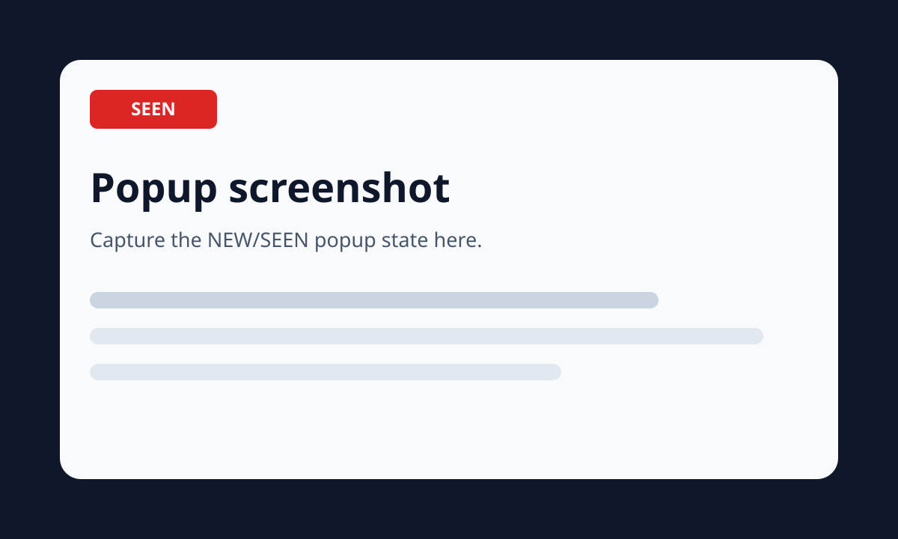
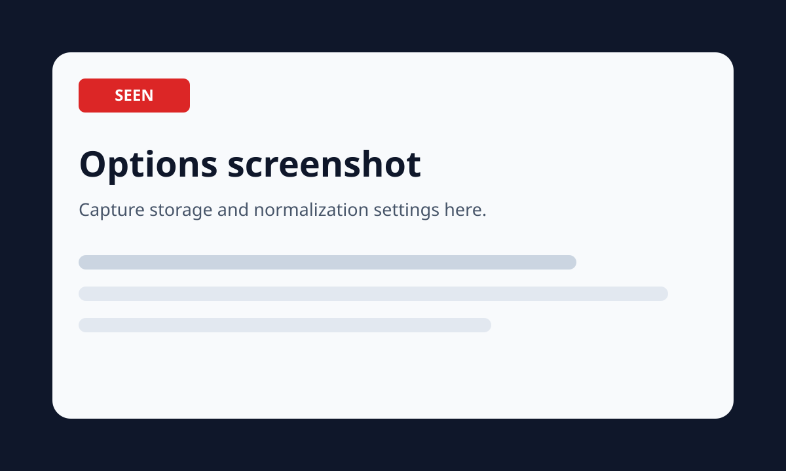

# Visited Page Tracker

Visited Page Tracker is a local-only Chrome Extension Manifest V3 project that records page visits and briefly places a red **SEEN 3 times**-style tag on pages that existed in the selected visit database before the current navigation.

The project supports two independent storage backends:

- **Per Profile:** IndexedDB inside the active Chrome profile. No native host is required.
- **Shared:** SQLite through a Python native messaging host. Several Chrome profiles can point to the same database and observe the same counts and history.

No browsing data is sent to a web server. The extension has no analytics, telemetry, remote JavaScript, or external UI framework.

## Screenshots






Replace these placeholders with real captures after loading the unpacked extension.

## Features

- Tracks top-frame HTTP and HTTPS navigations, reloads, redirects, back/forward navigation, and SPA route changes.
- Supports `history.pushState`, `history.replaceState`, `popstate`, and fragment navigation when fragment tracking is enabled.
- Stores normalized URL keys, original URLs, page titles, first/last visit times, visit counts, complete timestamp history, incognito flags, transition types, and storage source.
- Shows a dismissible, keyboard-accessible Shadow DOM **SEEN &lt;count&gt; times** tag for five seconds only when the page was already present before the current visit.
- Provides a live popup, configurable action badge, full paginated history UI, statistics, filters, bulk deletion, JSON/CSV export, and validated JSON import.
- Lets the popup disable tracking for the exact current normalized page or for the current domain and its subdomains.
- Provides explicit storage-mode migration with merge or replace behavior while preserving the source database.
- Supports configurable retention, excluded exact pages, excluded domains, wildcard URL patterns, title suppression, and URL normalization options.
- Uses atomic IndexedDB transactions and SQLite `BEGIN IMMEDIATE` transactions.
- Uses SQLite foreign keys, indexes, busy timeout, WAL where supported, bounded lock retries, atomic import, and replace-mode backups.
- Uses chunked shared exports and staged native-port imports so large transfers are validated before one database commit.
- Shows a visible warning/error badge when Shared mode is unavailable and never silently switches to IndexedDB.

## Architecture

### Extension

- `background/navigation-tracker.ts` listens to `webNavigation`, tracks committed transition metadata, clears stale tab state before navigation, deduplicates overlapping Chrome/content-script signals, normalizes URLs, applies exclusions, and records visits.
- `background/service-worker.ts` exposes the extension message API, handles migrations/import/export/retention, persists recent storage errors, and refreshes shared database status when the popup opens.
- `content/page-hook.ts` runs in the page’s main world and emits route-change events for History API navigation.
- `content/seen-tag.ts` runs in the isolated world, communicates with the service worker, and renders the Shadow DOM tag.
- `storage/indexeddb-storage.ts` implements the per-profile backend.
- `storage/native-storage.ts` implements the shared backend and Native Messaging protocol.
- `normalization/normalize-url.ts` owns all URL-key behavior.
- `popup`, `options`, and `history` contain plain HTML/CSS/TypeScript UIs.

### Native host

- `protocol.py` implements the four-byte little-endian length-prefixed JSON protocol.
- `schemas.py` validates actions, paths, filenames, URLs, imports, and request fields.
- `database.py` implements SQLite storage, transactions, retry logic, backup, statistics, migration/import, retention, and directory opening.
- `visited_page_tracker_host.py` dispatches only known actions and writes diagnostics exclusively to stderr.
- Windows uses a small compiled C# launcher so Chrome can start the Python host through an executable without administrator access.

## Chrome permissions

| Permission | Purpose |
|---|---|
| `storage` | Stores settings, small metadata, dedupe keys, and per-tab state. |
| `unlimitedStorage` | Prevents ordinary extension quotas from truncating IndexedDB history. |
| `tabs` | Reads the active tab URL/title and updates per-tab popup/badge state. |
| `webNavigation` | Detects committed, completed, history-state, and fragment navigations. |
| `nativeMessaging` | Connects to the local Python SQLite host in Shared mode. |
| `alarms` | Runs bounded automatic retention cleanup. |
| `http://*/*`, `https://*/*` | Runs the tracker and tag on normal web pages. |
| Optional `file:///*` | Used only after the user enables file tracking and Chrome grants file URL access. |

Chrome-internal pages, extension pages, `view-source:`, empty new tabs, and unsupported schemes are ignored.

## Prerequisites

- Google Chrome 116 or newer.
- Node.js 20 or newer and npm for development builds.
- TypeScript 5.8 or newer. `npm install` installs the declared development dependency.
- Python 3.9 or newer for Shared mode and native-host tests.
- Windows PowerShell 5.1+ for the Windows installer, or a POSIX shell on Linux/macOS.

## Build

```bash
cd extension
npm install
npm run typecheck
npm test
npm run build
```

Build output is written to:

```text
extension/dist
```

The supplied archive also includes a prebuilt `extension/dist` directory.

## Load the unpacked extension

1. Open `chrome://extensions`.
2. Enable **Developer mode**.
3. Select **Load unpacked**.
4. Choose the absolute path to `visited-page-tracker/extension/dist`.
5. Pin **Visited Page Tracker** from Chrome’s Extensions menu.

For source changes, rebuild and click the extension’s **Reload** button on `chrome://extensions`.

## Find the extension ID

1. Load `extension/dist` as an unpacked extension.
2. Open `chrome://extensions`.
3. Locate **Visited Page Tracker**.
4. Copy the 32-character ID shown on the card.

The native host manifest must contain this exact ID. An unpacked extension ID can change if the extension directory/key changes, so reinstall the host after an ID change.

## Install the native host

### Windows

Open PowerShell in `native-host` and run:

```powershell
Set-ExecutionPolicy -Scope Process Bypass
.\install-host.ps1 -ExtensionId "abcdefghijklmnopqrstuvwxyzabcdef"
```

The installer:

- validates the extension ID;
- checks Python 3.9+;
- copies the host into `%LOCALAPPDATA%\VisitedPageTrackerNativeHost`;
- compiles a per-user launcher executable;
- writes an exact-origin native host manifest;
- registers it under `HKCU\Software\Google\Chrome\NativeMessagingHosts\com.visited_page_tracker.host`;
- creates `%LOCALAPPDATA%\Google\Chrome\User Data\Global\VisitedPageTracker`;
- creates and tests `visited_page_tracker.sqlite3`;
- runs framed Native Messaging connectivity and database tests.
- reads back the HKCU registry value and generated manifest, then verifies the absolute launcher path and exact `allowed_origins` entry.

No administrator access is required.

After installation, run the full registration diagnostic with the same ID:

```powershell
.\test-installation.ps1 -ExtensionId "<real-id-from-chrome-extensions>"
```

It reports the registry key, registered manifest, launcher, expected and actual origins, Python executable/version, default shared directory writability, SQLite availability, and a direct framed host ping/configure result. Any required failure returns a nonzero exit code.

Uninstall:

```powershell
.\uninstall-host.ps1
```

Custom SQLite databases are not deleted.

### Linux

```bash
cd native-host
./install-host.sh --extension-id abcdefghijklmnopqrstuvwxyzabcdef --browser chrome
```

For Chromium:

```bash
./install-host.sh --extension-id abcdefghijklmnopqrstuvwxyzabcdef --browser chromium
```

Uninstall:

```bash
./uninstall-host.sh --browser chrome
```

### macOS

```bash
cd native-host
./install-host.sh --extension-id abcdefghijklmnopqrstuvwxyzabcdef --browser chrome
```

The installer writes the manifest under the current user’s Chrome NativeMessagingHosts directory and does not require administrator access.

## Configure Shared mode

1. Open the extension options page.
2. Select **Shared**.
3. Keep the default Windows directory or enter another absolute directory. The default is:

   ```text
   %LOCALAPPDATA%\Google\Chrome\User Data\Global\VisitedPageTracker
   ```

   The native host resolves it to the current user, for example `C:\Users\Alice\AppData\Local\Google\Chrome\User Data\Global\VisitedPageTracker`, and creates the directory automatically. Another example is:

   ```text
   H:\ChromeData\VisitedPageTracker
   ```

4. Keep or change the filename:

   ```text
   visited_page_tracker.sqlite3
   ```

5. Select **Test Connection**.
6. Confirm the resolved database path and native-host status.
7. Save settings.

The host creates the directory and database only during an explicit configure/test operation. If a configured database is later deleted, ordinary tracking returns `DATABASE_MISSING` instead of silently creating an empty replacement. Use **Test Connection** to recreate it intentionally.

Every native request uses a connected Native Messaging port with a 10-second deadline. A matching response, structured host error, disconnect, Chrome `runtime.lastError`, malformed response, mismatched request ID, or timeout settles the request exactly once and clears its timer. A timeout disconnects the port and returns `NATIVE_HOST_TIMEOUT`. The Options test has a 12-second service-worker deadline and re-enables its button in `finally`, so a service-worker restart or lost response cannot leave `Testing…` indefinitely.

## Use one shared database from several Chrome profiles

1. Load the same extension build in each profile.
2. Install/reinstall the native host for the extension ID used by that build.
3. In every profile, select Shared mode and enter the same absolute directory and filename.
4. Test the connection in each profile.
5. Visit the same URL from two profiles and verify the shared count increases.

SQLite `BEGIN IMMEDIATE`, WAL where supported, a busy timeout, and bounded retry logic serialize simultaneous writes.

## Storage migration

The options page provides:

- **Migrate Per-Profile Data to Shared**
- **Migrate Shared Data to Per-Profile**
- **Merge rather than replace**

Before switching modes, the options page explains the consequence and asks whether to migrate. The source database is never deleted automatically.

Merge behavior:

- deduplicates individual visit events by event ID;
- merges records by normalized URL;
- preserves the complete event history;
- rebuilds count, first visit, and last visit from the merged events;
- retains the newest title/original URL metadata.

Replace behavior clears only the target. Shared replace/import operations create a timestamped SQLite backup first.

## Import and export

### JSON export

Includes:

- schema version;
- export timestamp;
- storage mode;
- page records;
- visit-event records;
- settings only when **Include extension settings in JSON exports** is selected.

### CSV export

Produces one row per page and includes the complete timestamp history as a semicolon-separated field.

### JSON import

1. Open the History page.
2. Select **Import** and choose a JSON export.
3. Review page/visit counts and malformed-record counts.
4. Choose **Merge** or **Replace current storage**.
5. Confirm the import.

Invalid schemas or record types are rejected before application. Shared imports are staged over a persistent native connection and committed atomically only after all chunks and declared record counts validate.

## Privacy

- All page data remains in the current Chrome profile or the configured local SQLite file.
- No server endpoint exists in this project.
- No analytics or telemetry are included.
- No remote code is loaded.
- Titles and URLs are rendered with `textContent` rather than HTML insertion.
- The native host accepts only known actions and parameterized SQLite queries.
- Database filenames cannot contain path separators or traversal segments.
- The native host manifest is restricted to the exact extension origin.
- Incognito visits are ignored unless enabled in options and Chrome allows the extension in Incognito.

## Automated tests

### Extension and TypeScript

```powershell
cd extension
npm install
npm run typecheck
npm test
npm run build
Test-Path .\dist\manifest.json
```

Coverage includes URL normalization, first/repeat visits, count increments, timestamp history, duplicate suppression, storage selection, IndexedDB behavior, native-port response/disconnect/`lastError`/timeout handling, timeout cleanup, malformed and mismatched responses, Options state cleanup, Shared save gating, migration merge logic, import validation, exclusions, wildcard matching, SPA/reload settings, and the production build artifact.

### Native host and SQLite

From the `native-host` directory on Windows:

```powershell
python -m unittest discover -s tests -v
```

Coverage includes protocol framing and partial reads, request/path/filename validation, `%LOCALAPPDATA%` expansion, host ping/configure/error recovery, atomic first/repeat updates, duplicate-event rollback, simultaneous writes, bounded retry behavior, permission errors, missing-directory creation, chunked export, staged import, merge/replace backups, and Windows installer ID/origin validation.

## Manual verification walkthrough

### Windows Shared-mode connection and failure workflow

1. Build the extension and load the exact `extension\dist` directory through `chrome://extensions`.
2. Copy the extension ID from that loaded extension card.
3. In `native-host`, run `.\install-host.ps1 -ExtensionId "<copied-id>"`.
4. Run `.\test-installation.ps1 -ExtensionId "<copied-id>"` and require every check to pass.
5. Fully exit and restart Chrome so it reloads the per-user native-host registration.
6. Open the extension Options page.
7. Enter `%LOCALAPPDATA%\Google\Chrome\User Data\Global\VisitedPageTracker` as the directory.
8. Enter `visited_page_tracker.sqlite3` as the filename.
9. Select **Test Connection**.
10. Confirm the UI leaves `Testing…` within 12 seconds and shows **Connected**.
11. Confirm the full expanded path is displayed.
12. Select and save Shared mode.
13. Visit a webpage twice.
14. Open the SQLite file and confirm the page row and both visit rows exist.
15. Run `.\uninstall-host.ps1 -Confirm:$false`, fully restart Chrome, and test the connection again.
16. Confirm a visible native-host error appears within 12 seconds and that the saved storage backend does not switch to IndexedDB. Reinstall the host afterward with the copied ID.

Use the ID from the currently loaded `extension\dist`, not an older build or a different unpacked directory. Chrome authorizes native messaging by exact extension origin.

### General behavior walkthrough

1. Visit a page for the first time.
2. Confirm no SEEN count tag appears.
3. Reload the page.
4. Confirm the red tag appears as **SEEN 2 times** and disappears after five seconds.
5. Confirm the visit count becomes 2.
6. Open the same URL in another tab.
7. Confirm the count increases.
8. Restart Chrome.
9. Confirm data remains.
10. Test a SPA route change.
11. Switch to Shared mode.
12. Open another Chrome profile using the same database.
13. Confirm both profiles see the same count.
14. Disconnect or uninstall the native host.
15. Confirm a visible error badge/popup warning appears without fallback.
16. Reconnect, use **Test Connection**, and confirm tracking resumes.
17. Export and import data in merge and replace modes.
18. Test an excluded domain and wildcard pattern.
19. Test clearing history with confirmation.
20. Confirm page CSS cannot override the Shadow DOM tag and that removing the host node causes it to be reattached.

Additional checks:

- Change every tag corner, size, and opacity.
- Disable reload counting and verify reloads show existing state without incrementing.
- Disable SPA counting and verify route changes do not increment.
- Enable fragment tracking and test hash navigation.
- Enable file URL tracking, grant Chrome’s file access, and test a local HTML file.
- Delete the shared database while Chrome is open and verify `DATABASE_MISSING` is surfaced.
- Hold an external write lock briefly and verify bounded retry/recovery.

## Troubleshooting

### “Specified native messaging host not found”

- Confirm the installer used the exact extension ID currently displayed by `chrome://extensions`.
- Re-run the installer after moving/reloading an unpacked extension if its ID changed.
- Confirm the manifest name is `com.visited_page_tracker.host`.
- Restart Chrome after registration changes.

### Permission denied or inaccessible directory

- Use an absolute directory owned by the current user.
- Confirm a removable/network drive is connected.
- Avoid protected system directories.
- Select **Test Connection** to see the resolved path and error.

### Database missing

Tracking never silently creates a replacement after a configured database disappears. Restore the file from backup, or select **Test Connection** to explicitly create a new database.

### Database locked

The host uses a busy timeout and five bounded retries. Close other tools holding long exclusive transactions. The extension does not retry indefinitely.

### Corrupt database

1. Close every Chrome profile using the database.
2. Copy the database and any `-wal`/`-shm` files before repair.
3. Prefer a recent `*.backup-YYYYMMDD-HHMMSS.sqlite3` created by replace import.
4. Run an integrity check with Python:

   ```bash
   python3 - <<'PY'
   import sqlite3
   path = r"/absolute/path/visited_page_tracker.sqlite3"
   con = sqlite3.connect(path)
   print(con.execute("PRAGMA integrity_check").fetchall())
   con.close()
   PY
   ```

5. Restore a clean backup or export recoverable data before creating a new database.

### Popup shows old status

Open the popup again. Shared status is rechecked on popup load. A new navigation also rechecks storage before recording.

## Database recovery and backups

- Replace-mode shared imports create a full SQLite backup next to the active database.
- The source backend remains untouched during storage migration.
- For a live shared database, copy the main file together with `-wal` and `-shm`, or close Chrome first.
- JSON export is the most portable backup format because it includes complete page and visit-event records.

## Uninstallation

1. Export history if desired.
2. Remove the extension from `chrome://extensions`.
3. Run the native-host uninstaller for the operating system.
4. Delete custom SQLite files manually only when you no longer need them.

Per-profile IndexedDB data is removed with the Chrome profile/extension data. Removing one Chrome profile does not affect another profile or a shared SQLite database.

## Known Chrome limitations

- Chrome blocks extensions on internal pages such as `chrome://`, the Chrome Web Store, some PDF/internal viewers, and other privileged surfaces.
- File URL access requires both the optional origin permission and Chrome’s extension-level file access toggle.
- Incognito access must be granted by the user in Chrome.
- Unpacked extension IDs can change when the directory/key changes, requiring native-host manifest reinstallation.
- The action popup closes when focus moves away; it refreshes whenever reopened and also listens for tab changes while open.
- Native Messaging requires a separately installed local host in Shared mode. Per Profile mode remains fully functional without it.

## Security notes

- Never point the database filename field at a path; directory and filename are validated separately.
- Do not loosen `allowed_origins` in the native host manifest.
- Keep the native host files writable only by the current user.
- The directory-opening action uses an argument array or `os.startfile`; it never runs the configured path as a shell command.
- SQLite queries use parameters for user data and whitelisted identifiers for sorting.
- Diagnostic output goes to stderr only; stdout is reserved for framed JSON.

## Native messaging actions

The host validates and supports:

- `ping`
- `configureDatabase`
- `getDatabaseStatus`
- `recordVisit`
- `getPage`
- `searchPages`
- `getVisitEvents`
- `deletePage`
- `deleteDomain`
- `clearHistory`
- `getStatistics`
- `exportData`
- `importData`
- `migrateData`
- `openStorageDirectory`

Unknown actions are rejected with a structured error response.

## Project tree

```text
visited-page-tracker/
├── .gitignore
├── LICENSE
├── README.md
├── IMPLEMENTATION.md
├── docs/
│   └── screenshots/
│       ├── history-placeholder.svg
│       ├── options-placeholder.svg
│       └── popup-placeholder.svg
├── extension/
│   ├── assets/icons/
│   │   ├── icon-16.png
│   │   ├── icon-32.png
│   │   ├── icon-48.png
│   │   └── icon-128.png
│   ├── dist/                         # generated, ready to load unpacked
│   ├── manifest.json
│   ├── package.json
│   ├── scripts/
│   │   ├── build.mjs
│   │   └── run-tests.mjs
│   ├── src/
│   │   ├── background/
│   │   │   ├── badge-manager.ts
│   │   │   ├── dedupe.ts
│   │   │   ├── navigation-tracker.ts
│   │   │   └── service-worker.ts
│   │   ├── content/
│   │   │   ├── page-hook.ts
│   │   │   ├── seen-tag.css
│   │   │   └── seen-tag.ts
│   │   ├── history/
│   │   │   ├── history.css
│   │   │   ├── history.html
│   │   │   └── history.ts
│   │   ├── normalization/
│   │   │   └── normalize-url.ts
│   │   ├── options/
│   │   │   ├── options.css
│   │   │   ├── options.html
│   │   │   └── options.ts
│   │   ├── popup/
│   │   │   ├── popup.css
│   │   │   ├── popup.html
│   │   │   └── popup.ts
│   │   ├── shared/
│   │   │   ├── matchers.ts
│   │   │   ├── messages.ts
│   │   │   ├── runtime.ts
│   │   │   ├── settings.ts
│   │   │   └── utils.ts
│   │   ├── storage/
│   │   │   ├── indexeddb-storage.ts
│   │   │   ├── migration.ts
│   │   │   ├── native-storage.ts
│   │   │   ├── storage-factory.ts
│   │   │   └── storage-interface.ts
│   │   └── types/
│   │       ├── chrome.d.ts
│   │       └── models.ts
│   ├── tests/
│   │   ├── dedupe-spa.test.mjs
│   │   ├── fake-indexeddb.mjs
│   │   ├── indexeddb.test.mjs
│   │   ├── matchers.test.mjs
│   │   ├── migration.test.mjs
│   │   ├── normalization.test.mjs
│   │   └── storage-native.test.mjs
│   ├── tsconfig.json
│   └── tsconfig.test.json
└── native-host/
    ├── database.py
    ├── host_launcher.cs
    ├── install-host.ps1
    ├── install-host.sh
    ├── manifests/
    │   └── com.visited_page_tracker.host.json.template
    ├── protocol.py
    ├── schemas.py
    ├── test_host.py
    ├── tests/
    │   ├── test_database.py
    │   ├── test_protocol.py
    │   └── test_schemas.py
    ├── uninstall-host.ps1
    ├── uninstall-host.sh
    └── visited_page_tracker_host.py
```

## License

MIT. See `LICENSE`.
